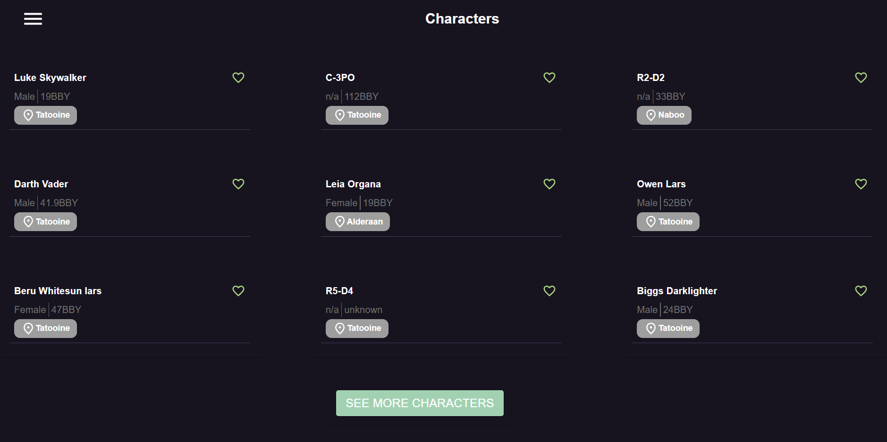
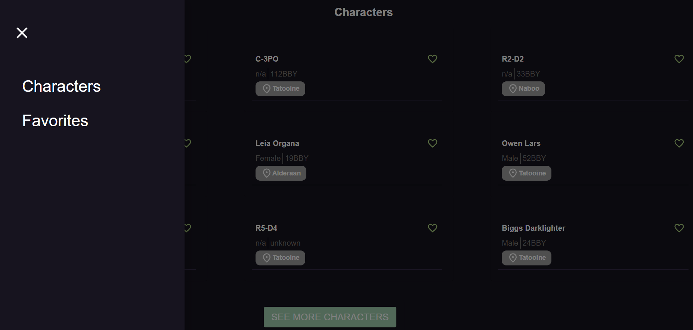
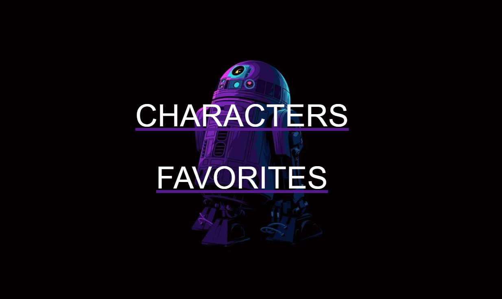

<a id="readme-top"></a>

<br />
<div align="center">
  <a href="https://github.com/othneildrew/Best-README-Template">
    
  </a>

  <h3 align="center">Star Wars Xseed</h3>

</div>

<details>
  <summary>Table of Contents</summary>
  <ol>
    <li>
      <a href="#about-the-project">About The Project</a>
      <ul>
        <li><a href="#built-with">Built With</a></li>
      </ul>
    </li>
    <li>
      <a href="#getting-started">Getting Started</a>
      <ul>
        <li><a href="#installation">Installation</a></li>
      </ul>
    </li>
    <li><a href="#usage">Usage</a></li>
    <li><a href="#contact">Contact</a></li>
    <li><a href="#acknowledgments">Acknowledgments</a></li>
  </ol>
</details>

## About The Project

This project is a responsive React SPA that provides the user a minimalistic interface to check data from Star Wars' characters. Plus the opportunity to add your favorites characters to a list and filter them by name.

### Built With

- 
- 
- 
- 
- 
- 

## Getting Started

First of all you must download this repository from Github as ZIP or clone it.

### Installation

1. Clone or download as ZIP the repository
   ```sh
   git clone https://github.com/sanavalos/xseed-frontend
   ```
2. Install NPM packages
   ```sh
   npm install
   ```
3. In case of errors

   - Delete package-lock.json file
   - Repeat step 2

## Usage

The first page you will see is the default route: /characters



At the top left you have the hamburger menu showing you 2 available options



And last but no least you can access to the /home page in case something goes wrong



## Contact

Santiago Germán Avalos - santiago.avalos@outlook.com

Github repo: [Star Wars Xseed](https://github.com/sanavalos/xseed-frontend)

<p align="right"><a href="#readme-top">back to top</a></p>
